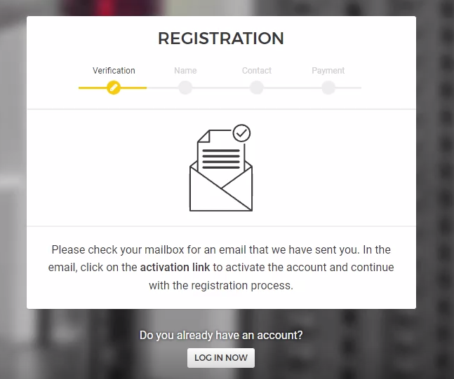

# NEAR STAKEWARS 
* Start: 13-07-2022
* End: 13-09-2022

## What do we need?

1. Credit Card or PayPal with money - 30-50€

2. The server, the instructions below👇

3. And a program to manage our server remotely
```
(MobaXterm)[https://mobaxterm.mobatek.net/]
(PuTTY)[https://www.putty.org/]

```

## Part I Register, and order dedicated server


## To begin with, you need to buy a server

In [Challenge 005](https://github.com/near/stakewars-iii/blob/main/challenges/005.md) you can choose from the following services
* Amazon Web Services
* Google Cloud Platform
* Microsoft Azure
* IBM Cloud
* DigitalOcean
* Hetzner

We will show you on the example of [Hetzner](https://www.hetzner.com/))


#### Server Requirements
1. Choosing a server
Please see the hardware requirement below:


| Hardware       | Chunk-Only Producer  Specifications                                   |
| -------------- | ---------------------------------------------------------------       |
| CPU            | 4-Core CPU with AVX support                                           |
| RAM            | 8GB DDR4                                                              |
| Storage        | 500GB SSD                                                             |


2. Go to [https://www.hetzner.com/](https://www.hetzner.com/)
At the top of the site select Dedicated

2. Click on Server Finder and choose the server you like, but its specifications should not be below the recommended

Here we see that the second server with NVMe SSD fits our hardware requirement

3. Let's proceed to ordering a server using the AX41-NVMe as an example


* We press on Order

4. We will be redirected on configuration of a server


* Let's scroll down to selection of operating system


* Here we can choose if we want a new operating system or if we want to install a new one, we choose Rescue System

5. Then click on Order Now

* We will be redirected to confirm the order


* Click Save


* Here we click on Checkout

6. And then comes the account login page


* Here we click on Register Now - if you do not have an account
* Or log in through your account

Registration here is standard and not complicated


| Enter:           | Input:             |
|----------------  | ------------------ |
| E-mail           | Your E-mail        |
| Password         | Your Password      |
| Repeat password  |                    |


7. Go to the mailbox





* Confirm registration

8. Input First Name and Surname


| Enter:         | Input:             |
|--------------- | ------------------ |
| First Name     |                    |
| Last Name      |                    |


9. Input Your contact information


| Your contact information | Input:             |
|------------------------- | ------------------ |
| Street                   |                    |
| Postal Code              |                    |
| City                     |                    |
| Country                  |                    |
| Phone                    |                    |


8. Next we need to choose our payment method


| Payment                  | Choice             |
|------------------------- | ------------------ |
| SEPA                     |                    |
| BANK TRANSFER            |                    |
| CREDIT CARD              |✅                  |
| PAYPAL                   |                    |


## Now we just have to wait until the server appears in our personal cabinet
* Wait 1-10 minutes


Now when our server is displayed we can proceed to install the OS

Click on our server, click on the Linux tab and here you will find the following repositories to choose from


We recommend distributions that have a checkmark ✅


| Linux                       | Choice             |
|---------------------------- | ------------------ |
| Alma Linux                  |                    |                   
| Arch Linux                  |                    |
| CentOS                      |                    |
| Debian 10                   | ✅                 |
| Debian 11                   | ✅                 |
| Rocky Linux                 |                    |
| Ubuntu 18.04.5 Lts minimal  | ✅                 |
| Ubuntu 20.04.3 Lts minimal  | ✅                 |
| Ubuntu 22.04 Lts base       | ✅                 |
